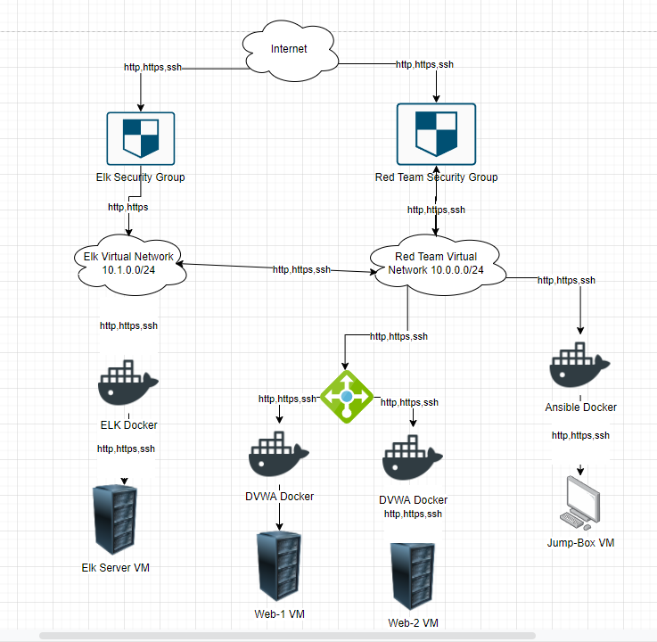
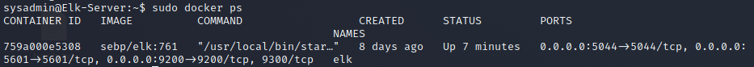
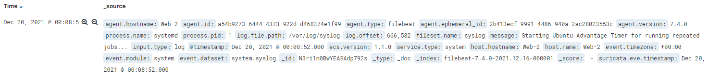
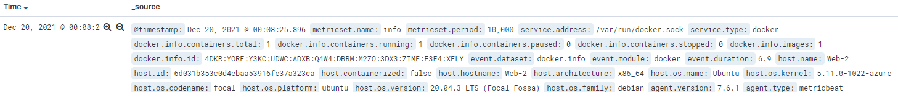

# Automated ELK Stack Deployment

### The files in this repository were used to configure the network depicted below.

These files have been tested and used to generate a live ELK deployment on Azure. They can be used to either recreate the entire deployment pictured above. Alternatively, select portions of the Filebeat-Metricbeat-playbook.yml file may be used to install only certain pieces of it, such as Filebeat.

  - Ansible/Filebeat-Metricbeat-playbook.yml

This document contains the following details:
- Description of the Topology
- Access Policies
- ELK Configuration
  - Beats in Use
  - Machines Being Monitored
- How to Use the Ansible Build

 

## Description of the Topology

The main purpose of this network is to expose a load-balanced and monitored instance of DVWA, the D*mn Vulnerable Web Application.

Load balancing ensures that the application will be highly available, in addition to restricting inbound access to the network.
- What aspect of security do load balancers protect?
- Answer: They protect the availability aspect of security from the CIA framework

 

- What is the advantage of a jump box?
- Answer: Provides a single point of administration rather than many individual points. This also makes it easy to log activities for security purposes and audits

 

Integrating an ELK server allows users to easily monitor the vulnerable VMs for changes to the VM's file systems and system metrics.
- What does Filebeat watch for?
- Answer: Filebeat watches for any changes to the system files

 

- What does Metricbeat record?
- Answer: Metric records the system metrics of the VM's like CPU usage or ssh logins

 

The configuration details of each machine may be found below.

| Name     | Function | IP Address | Operating System |
|----------|----------|------------|------------------|
| Jump Box | Gateway  | 10.0.0.4   | Linux |
| Web-1 | Web Server 1 | 10.0.0.5  | Linux |
| Web-2 | Web Server 2 | 10.0.0.6 | Linux |
| ELK-Server | Monitoring Server | 10.1.0.5 | Linux |

 

## Access Policies

The machines on the internal network are not exposed to the public Internet.

Only the Jump Box machine can accept connections from the Internet. Access to this machine is only allowed from the following IP addresses:
- 76.93.187.62

Machines within the network can only be accessed by the Jump Box.
- Which machine did you allow to access your ELK VM? What was its IP address?
- Answer: The Jump box has access to the ELK VM. Its IP address is 10.0.0.4.

A summary of the access policies in place can be found in the table below.

| Name     | Publicly Accessible | Allowed IP Addresses |
|----------|---------------------|----------------------|
| Jump Box | Yes | 76.93.187.62 |
| ELK-Server | No | 10.0.0.4 |
| Web-1 | No | 10.0.0.4 |
| Web-2 | No | 10.0.0.4 |

 

## Elk Configuration

Ansible was used to automate configuration of the ELK machine. No configuration was performed manually, which is advantageous because...
- What is the main advantage of automating configuration with Ansible?
- You can scale it and automatically configure hundreds of machines

The playbook implements the following tasks:
- Install Docker.io
- Install pip3
- Install Docker Python Module
- Download and Launch ELK Container
- Enable My Docker Services

The following screenshot displays the result of running `docker ps` after successfully configuring the ELK instance.

 

## Target Machines & Beats
This ELK server is configured to monitor the following machines:
- Web-1 IP: 10.0.0.5
- Web-2 IP: 10.0.0.6

We have installed the following Beats on these machines:
- Filebeat
- Metricbeat

These Beats allow us to collect the following information from each machine:
- Filebeat collects system logs to tack any changes made to system files. We can receive Apache logs this way. An example of a filebeat log how one looks can be seen here:

- Metricbeat collects logs about system metric like ssh logins or cpu usage. We can even get logs about failed sudo attempts. An example of a metricbeat log can be seen here:

 

## Using the Playbook
In order to use the playbook, you will need to have an Ansible control node already configured. Assuming you have such a control node provisioned:

SSH into the control node and follow the steps below:
- Copy the all playbooks file to the ansible control node
- Update the /etc/ansible/hosts file to include the machines you want to run the playbook on. Then once you specified the machines with group labels in the host file you can edit the playbook where you can find the host field. There you can specify the machine groups you want the play book ran on.
- Run the playbook, and navigate to http://10.1.0.5:5601/app/kibana to check that the installation worked as expected.